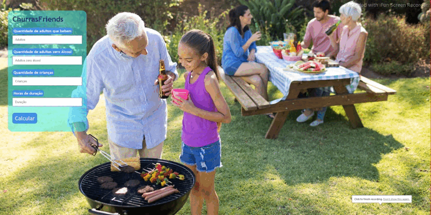

<h1>ChurrasFriends</h1>

> Status: Concluído

<h3>Desafio do curso Programador BR no módulo de Javascript.</h3>

<strong>Criação de um sistema onde captura-se os valores inseridos nos campos solicitados voltando assim uma sugestão para realização de um churrasco.
</strong>

<h2>Tecnologias utilizadas</h2>

HTML - JAVASCRIPT - CSS

<h2>O projeto</h2>
